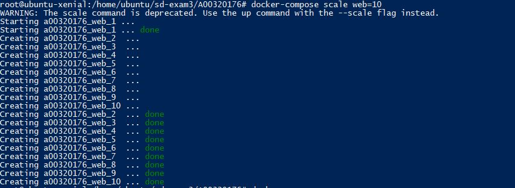
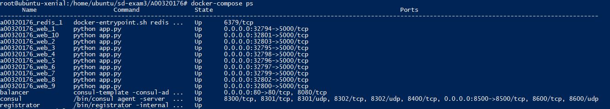
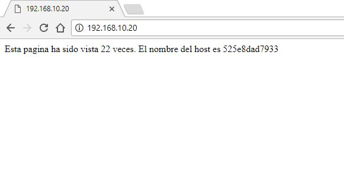
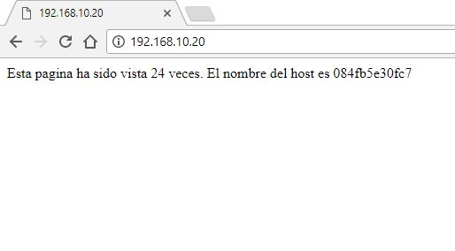
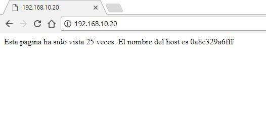
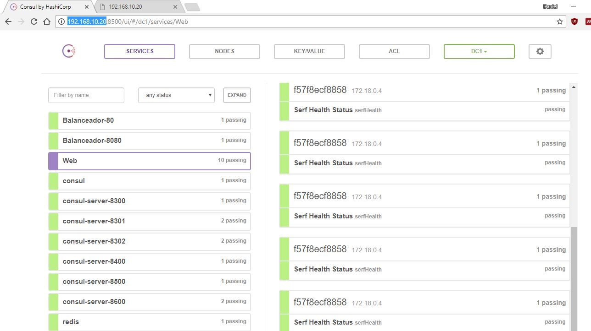

# Parcial 3 - Daniel Gutierrez - A00320176

Repositorio: https://github.com/dgutierrez1/sd-exam3/tree/A00320176/add-solution

## Comandos de linux necesarios para el aprovisionamiento de los servicios solicitados

Se deben utilizar diferentes comandos dependiendo del microservicio que se este configurando

| Comando | Descripcion |
| ------------- | ------------- |
| pip install -r requirements.txt | Se utilizo para la instalacion de los paquetes necesarios para el funcionamiento de la aplicacion de Flask. Los paquetes estaban especificados en el archivo requirements.txt |
| firewall-cmd --zone=public --add-port=80/tcp --permanent	  | Se usa para abrir el puerto especificado  |
| yum -y install wget && yum -y install unzip && yum -y install	  | Se usa para instalar los paquetes necesarios en el contenedor  |

El uso de Docker y Docker-compose disminuye sustancialmente el uso de otros comandos que serian necesarios en la configuracion de la maquina normalmente.


## Escriba los archivos Dockerfile para cada uno de los servicios solicitados

#### Haproxy
```Dockerfile

#Instalacion
RUN yum -y install wget && yum -y install unzip && yum -y install haproxy

#Configuracion de puertos
EXPOSE 80 8080

#Instalacion de consul-template
ENV CONSUL_TEMPLATE_VERSION 0.19.3
ADD https://releases.hashicorp.com/consul-template/${CONSUL_TEMPLATE_VERSION}/consul-template_${CONSUL_TEMPLATE_VERSION}_SHA256SUMS /tmp/
ADD https://releases.hashicorp.com/consul-template/${CONSUL_TEMPLATE_VERSION}/consul-template_${CONSUL_TEMPLATE_VERSION}_linux_amd64.zip /tmp/

#Configuracion de consul-template
RUN cd /tmp && \
    sha256sum -c consul-template_${CONSUL_TEMPLATE_VERSION}_SHA256SUMS 2>&1 | grep OK && \
    unzip consul-template_${CONSUL_TEMPLATE_VERSION}_linux_amd64.zip && \
    mv consul-template /bin/consul-template && \
    rm -rf /tmp


# Copiar el archivo de configuracion del haproxy
WORKDIR /etc/haproxy
ADD haproxy.ctmpl .
```


#### Web

```Dockerfile
FROM python:3.4-alpine
ADD . /code
WORKDIR /code
#EXPOSE 5000
RUN pip install -r requirements.txt
CMD ["python", "app.py"]
```


## Docker-compose

#### `docker-compose.yml`
```yml
version: '2'

services:

  consul:
    image: troyfontaine/consul-server
    container_name: consul
    ports:
      - 8500:8500
    command: "-bind=0.0.0.0 -server -bootstrap"


  registrator:
    image: "gliderlabs/registrator:latest"
    container_name: registrator
    command: "-internal consul://consul:8500"
    links:
      - consul:consul
    volumes:
      - /var/run/docker.sock:/tmp/docker.sock

  balancer:
    build: ./haproxy
    container_name: balancer
    ports:
      - 80:80
    links:
      - consul:consul
    command: consul-template -consul-addr=consul:8500 -template="/etc/haproxy/haproxy.ctmpl:/etc/haproxy/haproxy.cfg:/usr/sbin/haproxy -f /etc/haproxy/haproxy.cfg -D -p
 /var/run/haproxy.pid"
    environment:
      - SERVICE_NAME=Balanceador

  redis:
    image: "redis:alpine"

  web:
    build: ./web
    ports:
      - 5000
    volumes:
     - ./web:/code
    environment:
     - SERVICE_NAME=Web
```

## Evidencias funcionamiento
Escalando los contenedores web


La lista de los contenedores corriendo


El balanceador direcciona las peticiones a los diferentes contenedores disponibles




Evidencia en Consul


## Problemas encontrados y las acciones efectuadas para su solución

| Problema | Solucion |
| ------------- | ------------- |
| Poder evidenciar efectivamente que el balanceador esta direccionando a diferentes nodos. | En la aplicacion web se uso una libreria de Python con la que se puede obtener el nombre del host y mostrarlo al usuario |
| Errores en el balanceador usando NGINX | Inicialmente se intento usar NGINX pero en la configuracion con el template hubo muchos errores, la mayoria durante la creacion del contenedor. El consul template tambien genero errores porque el repositorio de donde se estaba obtenido habia cambiado su estructura. Al final se utilizo HAPROXY y se pudo configurar el balanceador facilmente.  |


